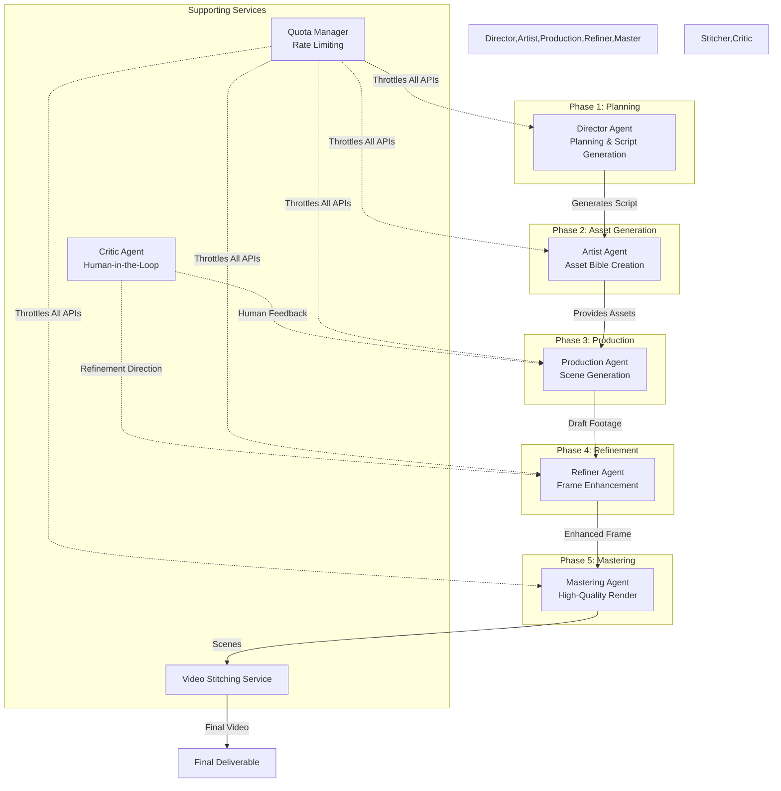

# Veo Studio Multi-Agent Orchestration

## High-Level Architecture Diagram



## Agent Roles & Responsibilities

| Agent | Phase | Primary Responsibility | Model |
|-------|-------|----------------------|-------|
| **Director** | 1 - Planning | Creates structured video script with scenes | `gemini-3-pro-preview` |
| **Artist** | 2 - Asset Gen | Generates character & environment bibles | `gemini-3-pro-image-preview` |
| **Production** | 3 - Production | Generates scene videos with director's plan | `veo-3.1-fast-generate-preview` |
| **Refiner** | 4 - Refinement | Enhances draft frames to 4K quality | `gemini-3-pro-image-preview` (Vision) |
| **Master** | 5 - Mastering | Renders final high-quality video | `veo-3.1-generate-preview` |

## Supporting Services

| Service | Purpose | Implementation |
|----------|---------|----------------|
| **Stitcher** | Concatenates scene videos into final output | FFmpeg.wasm |
| **Critic** | Human-in-the-loop feedback system | Hybrid AI + Manual |
| **Quota Manager** | Enforces API rate limits | Token Bucket pattern |

## Orchestration Pattern

### Sequential Flow (Default)
```
Director → Artist → Production → Refiner → Master → Output
```

### Feedback Loop (Critic Integration)
```
           ↺ Critic Feedback ↺
              ↓              ↓
         Production     Refiner
              ↓              ↓
              Master → Stitcher → Output
```

### Quota-Aware Flow
```
All Agents → Quota Manager → API Calls
           ↺ (Wait on Throttle)
```

## State Management

**Global State Context:** `ProductionContext`
- Tracks current pipeline phase
- Stores artifacts across all phases
- Manages logs and error state
- Provides undo/redo for critic feedback

**Phase Transition Rules:**
- Each phase must complete before next begins
- Critic can trigger regeneration (Production/Refinement)
- Quota violations pause execution until cooldown

## Execution Models

| Execution Mode | Veo API | Tests | Use Case |
|-----------------|----------|-------|----------|
| **Unit Tests** | Mocked | All mocks | Fast CI/CD |
| **Integration Tests** | Mocked | Real Gemini | Verify AI integration |
| **Production** | Real API | None | Actual video generation |

## Key Design Principles

1. **Single Responsibility** - Each agent has one well-defined purpose
2. **Quota Safety** - All API calls guarded by rate limiters
3. **Human-in-the-Loop** - Critic agent enables iterative refinement
4. **Modular Extraction** - Services (stitcher, quota) are testable in isolation
5. **Cyclic Feedback** - Pipeline can loop back from Phase 4/3 based on feedback
